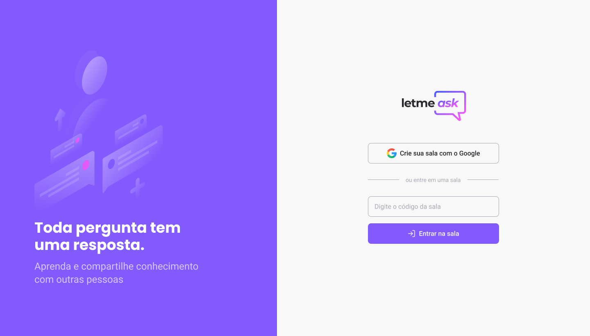
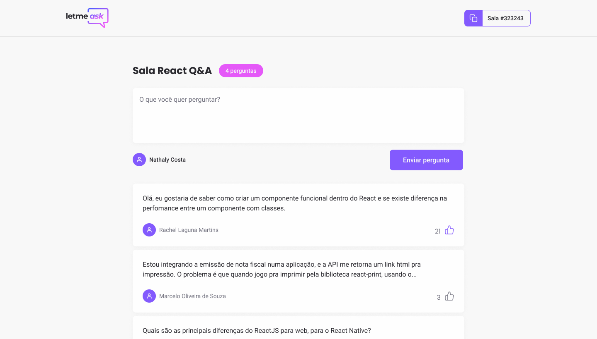

<h1 align="center">
  
</h1>

<p align="center">
  <a href="#-projeto">Projeto</a>&nbsp;&nbsp;&nbsp;|&nbsp;&nbsp;&nbsp;
  <a href="#-layout">Layout</a>&nbsp;&nbsp;&nbsp;|&nbsp;&nbsp;&nbsp;
  <a href="#-tecnologias-utilizadas">Tecnologias Utilizadas</a>&nbsp;&nbsp;&nbsp;|&nbsp;&nbsp;&nbsp;
  <a href="#-como-executar">Como executar</a>&nbsp;&nbsp;&nbsp;|&nbsp;&nbsp;&nbsp;
  <a href="#-licença">Licença</a>
</p>

<p align="center">
  

 
</p>

<br>

<p align="center">
  
  
</p>

## 💻 Projeto

O Letmeast é um app para realizar perguntas e respostas dentro de determinadas salas criadas pelos usuários.

Realizado pela **[@Rocketseat](https://github.com/Rocketseat)** durante o Next Level Week Together, trilha ReactJS.

## 🔖 Layout

Você pode visualizar o layout do projeto através [desse link](https://www.figma.com/file/u0BQK8rCf2KgzcukdRRCWh/Letmeask/duplicate). É necessário ter conta no [Figma](http://figma.com/) para acessá-lo.

## ✨ Tecnologias utilizadas

Esse projeto foi desenvolvido com as seguintes tecnologias:

- [React](https://reactjs.org)
- [TypeScript](https://www.typescriptlang.org/)
- [Firebase](https://console.firebase.google.com/)

## 🚀 Como executar

- Você precisa instalar o [Node.js](https://nodejs.org/en/) e [Yarn](https://yarnpkg.com/) para executar este projeto.

**Clone o projeto**

```bash
  git clone https://github.com/FlavioSant/letmeask-nlw-together.git
```

**Siga os passo abaixo**

```bash
  #Instale as dependências
  yarn

  #Execute o projeto
  yarn start
```

O aplicativo estará para acesso em seu navegador em: `http://localhost:3000`

## 📄 Licença

Esse projeto está sob a licença MIT. Veja o arquivo [LICENSE](LICENSE) para mais detalhes.

---

By Flávio Santos.
